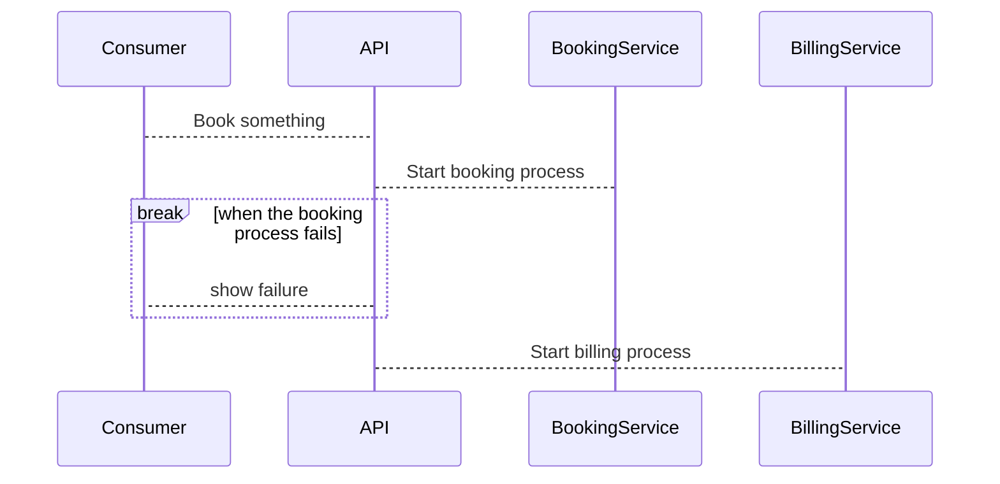

# slidev-theme-renuo

[](https://www.npmjs.com/package/slidev-theme-renuo)

A theme for [Slidev](https://github.com/slidevjs/slidev), inspired by Renuo's branding.

## Install

Add the following frontmatter to your `slides.md`. Start Slidev then it will prompt you to install the theme automatically.


```markdown
---
theme: renuo
---
```

Learn more about [how to use a theme](https://sli.dev/themes/use).

## Layouts

This theme provides the following layouts:

### Cover


```markdown
--- 
layout: cover
// all values below are optional
showContactText: true 
website: https://renuo.ch
email: hello@renuo.ch
phone: +41 44 500 55 66
showAddressText: true 
addressHeader: Address 
company: Renuo AG
street: Industriestrasse 44
zip: 8304 
city: Wallisellen 
---

# Renuo Presentation Theme

Presentation slides for engineers
```

### Intro


```markdown
---
layout: intro
---

Primary Heading
# Introduction Slide
Secondary Heading
```

### Default


```markdown
---
showLogo: true // show the Renuo logo (optional)
---
```

### Quote


```markdown
---
layout: quote
---
```

### Full


```markdown
---
layout: full
---
```

### Center


```markdown
---
layout: center
---
```

## Configurations

### Mermaid

This theme supports [Mermaid](https://mermaid-js.github.io/mermaid/) diagrams.


```markdown


## Contributing

- `npm install`
- `npm run dev` to start theme preview of `example.md`
- Edit the `example.md` and style to see the changes
- `npm run export` to generate the preview PDF
- `npm run screenshot` to generate the preview PNG
