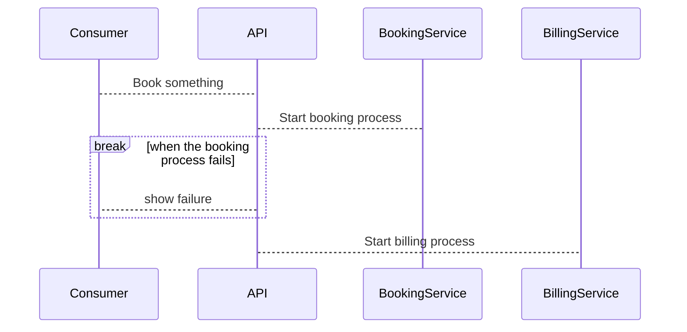

# Renuo Theme

Presentation slides for engineers

---
layout: cover
showContactText: false
showAddressText: false
---

# This is a cover slide

This slide does not have contact and address information

---
layout: intro
---

First heading

# This is an intro title

Subheading

---


# What is Slidev?

Slidev is a slides maker and presenter designed for developers, consist of the following features

- 📝 **Text-based** - focus on the content with Markdown, and then style them later
- 🎨 **Themable** - theme can be shared and used with npm packages
- 🧑‍💻 **Developer Friendly** - code highlighting, live coding with autocompletion
- 🤹 **Interactive** - embedding Vue components to enhance your expressions
- 🎥 **Recording** - built-in recording and camera view
- 📤 **Portable** - export into PDF, PNGs, or even a hostable SPA
- 🛠 **Hackable** - anything possible on a webpage

Read more about [Why Slidev?](https://sli.dev/guide/why)

---
showLogo: false
---

# Navigation

This slide is configured to hide the logo

## Keyboard Shortcuts

|     |     |
| --- | --- |
| <kbd>space</kbd> / <kbd>tab</kbd> / <kbd>right</kbd> | next animation or slide |
| <kbd>left</kbd>  / <kbd>shift</kbd><kbd>space</kbd> | previous animation or slide |
| <kbd>up</kbd> | previous slide |
| <kbd>down</kbd> | next slide |

---
layout: image-right
image: https://cover.sli.dev
---

# Code

Use code snippets and get the highlighting directly!

```ts
interface User {
  id: number
  firstName: string
  lastName: string
  role: string
}

function updateUser(id: number, update: Partial<User>) {
  const user = getUser(id)
  const newUser = { ...user, ...update }
  saveUser(id, newUser)
}
```

---
layout: full
---

```vue
<script setup>
import SlideBackground from "../components/slideBackground.vue";
import ContactInfo from "../components/renuoContactInfo.vue";
import AddressCard from "../components/renuoContactCard.vue";

const props = defineProps({
  showContactText: {
    type: Boolean,
    default: true
  },
  showAddressText: {
    type: Boolean,
    default: true
  }
});
</script>
<template>
  <div class="absolute p-5 h-full">
    <SlideBackground class="top-0" />
  </div>
  <div id="cover-slide" class="slidev-layout cover bg-primary">
    <div class="relative w-full text-white">
      <AddressCard :show-address-text="props.showAddressText" />
      <ContactInfo :show-contact-text="props.showContactText" />
      <div class="slot">
        <slot />
      </div>
    </div>
  </div>
</template>
```

---
showLogo: false
---

# This is a example mermaid diagram



---
layout: quote
---

> Ruby on Rails (simplified as Rails) is a server-side web application framework written in Ruby under the MIT License. Rails is a model–view–controller (MVC) framework, providing default structures for a database, a web service, and web pages. It encourages and facilitates the use of web standards such as JSON or XML for data transfer and HTML, CSS and JavaScript for user interfacing. In addition to MVC, Rails emphasizes the use of other well-known software engineering patterns and paradigms, including convention over configuration (CoC), don't repeat yourself (DRY), and the active record pattern.
>
> https://en.wikipedia.org/wiki/Ruby_on_Rails

---
layout: two-cols
---

# Left

This shows on the left

::right::

# Right

This shows on the right

---
layout: two-cols-header
---

# This is a header

::left::

## Left Column
This is some text for the left column

::right::

## Right Column
This is some text for the right column

---
layout: center
class: "text-center"
---

# Learn More

[Documentations](https://sli.dev) / [GitHub Repo](https://github.com/slidevjs/slidev)
